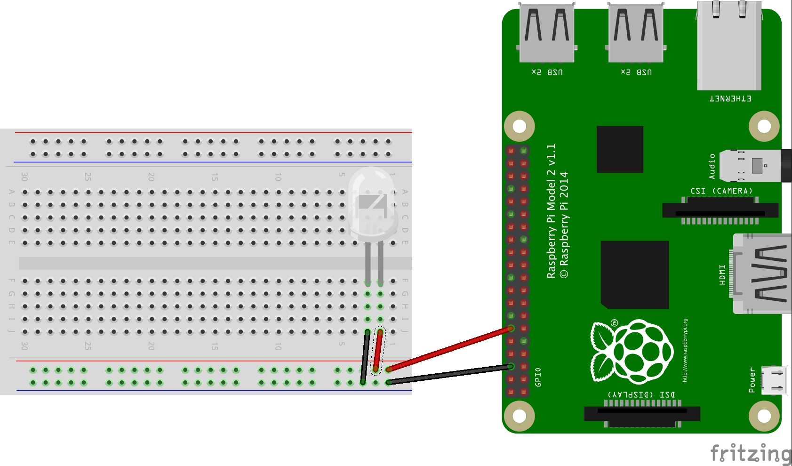

# Home Automation
This project was created in node.js using modules like [johnny-five](http://johnny-five.io/) and [cron](https://github.com/ncb000gt/node-cron). The aim was to switch on/off lights at a certain time.

# Getting started
* If not already installed, install [node](https://www.digitalocean.com/community/tutorials/how-to-install-node-js-on-ubuntu-16-04).
* Clone this repo and change directory to it in the terminal: `~ $ cd nodejs-home-automation`.
* Now do `npm install`. This will install all modules used.

# Starting the app
* Run `nodemon app.js` or `node app.js`.

# Using the app
* In the `app.js` file insert the time you would like for your lights and the days you want to toggle it.
```javascript
  cronTime: '0 45 17 * * 1-5'
            ________
```
* Check if you are using 12 hour or 24 hour time format.

# Setting up hardware
 
 * The [Raspberry Pi](https://en.wikipedia.org/wiki/Raspberry_Pi) acts as an automatic switch so if you plan to use big lights instead of small led's, you need to use a [relay](https://www.amazon.com/Kootek-Channel-Module-Arduino-Raspberry/dp/B00C8O9KHA) to use mains power.
